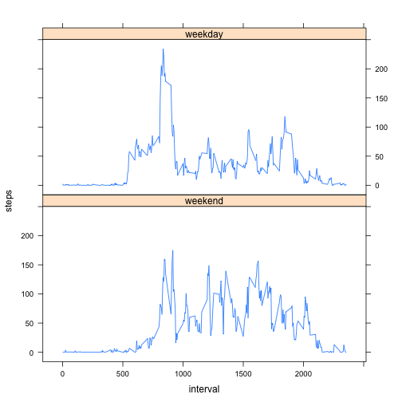

# Reproducible Research: Peer Assessment 1

Although it would not be part of a final report, I have included the
assignment requirements here (in italics) to make reviewing for
assessment easier.

## Loading and preprocessing the data

1. *Load the data (i.e. `read.csv()`)*
2. *Process/transform the data (if necessary) into a format suitable
   for your analysis*

   
   ```r
   data <- read.csv(unz("activity.zip", "activity.csv"),
                    header=TRUE,
                    colClasses=c("numeric", "Date", "numeric"))
   ```

## What is mean total number of steps taken per day?

For this part of the assignment, you can ignore the missing values in
the dataset.

1. *Make a histogram of the total number of steps taken each day*

   The following histogram shows the distribution of the total number
of steps per day over the number of days that total was
reached.

   I use `na.rm=TRUE` here, so missing measurements are not included
as part of the sum, and days without any measurements had a sum of
zero.

   
   ```r
   dailySteps <- rowsum(data$steps, data$date, na.rm=TRUE)
   hist(dailySteps, breaks=10, main="Histogram of daily steps")
   ```
   
    
   
   ```r
   meanSteps <- mean(dailySteps)
   medianSteps <- median(dailySteps)
   ```

2. *Calculate and report the* **mean** *and* **median** *total number of
   steps taken per day*

   Answer: The daily step mean is **9354.2**
and the median is **10395.0**. Here they are
shown along with the distribution of the total number of steps per day
across the whole data set, including the mean and the median:

   
   ```r
   boxplot(dailySteps, main="Daily steps")
   abline(h=meanSteps)
   legend("topright", summary(dailySteps))
   ```
   
    

## What is the average daily activity pattern?

1. *Make a time series plot (i.e. `type = "l"`) of the 5-minute
   interval (x-axis) and the average number of steps taken, averaged
   across all days (y-axis)*

   
   ```r
   meanStepsByInterval <- aggregate(steps ~ interval, data=data, "mean")
   plot(meanStepsByInterval, type="l")
   ```
   
    

2. *Which 5-minute interval, on average across all the days in the
   dataset, contains the maximum number of steps?*

   
   ```r
   maxRow <- which.max(meanStepsByInterval$steps)
   maxInterval <- meanStepsByInterval[maxRow,]$interval
   ```

   Answer: Interval **835** has the highest number of
steps, averaged across all the days in the dataset.

## Imputing missing values

*Note that there are a number of days/intervals where there are missing
values (coded as `NA`). The presence of missing days may introduce
bias into some calculations or summaries of the data.*

1. *Calculate and report the total number of missing values in the
   dataset (i.e. the total number of rows with `NA`s)*

   
   ```r
   missingRowCount <- sum(!complete.cases(data))
   ```

   Answer: There are **2304** rows with missing values
in the dataset.

2. *Devise a strategy for filling in all of the missing values in the
   dataset. The strategy does not need to be sophisticated. For
   example, you could use the mean/median for that day, or the mean
   for that 5-minute interval, etc.*

   Answer: My strategy is to use the mean for the day. This seems like
a bad idea, as the lecturer stated, but I'm doing it as it's a
required part of this assignment.

   I calculate a lookup table for each interval, and create a function
which, when given a row, will return either the steps for that row, or
the mean (from the lookup table) if the steps are missing from the
row.

   
   ```r
   meanForInterval <- tapply(data$steps, data$interval, "mean", na.rm=TRUE)
   hist(meanForInterval)
   ```
   
    
   
   ```r
   library(stringr)
   stepsOrMeanForInterval <- function(row) {
           if (is.na(row[1])) {
                   interval <- str_trim(row[3])
                   meanForInterval[[interval]]
           }
           else {
                   as.numeric(row[1])
           }
   }
   ```

3. *Create a new dataset that is equal to the original dataset but with
   the missing data filled in.*

   I use the `stepsOrMeanForInterval` function to create a vector of
steps for each row in the dataset. The new data set `newdata` uses
this vector for its `steps` column.

   
   ```r
   imputedSteps <- apply(data, 1, stepsOrMeanForInterval)
   newdata <- within(data, { steps <- imputedSteps })
   ```

4. *Make a histogram of the total number of steps taken each day and
   calculate and report the mean and median total number of steps
   taken per day. Do these values differ from the estimates from the
   first part of the assignment? What is the impact of imputing
   missing data on the estimates of the total daily number of steps?*

   
   ```r
   newDailySteps <- rowsum(newdata$steps, newdata$date, na.rm=TRUE)
   hist(newDailySteps, breaks=10, main="Histogram of daily steps (imputed)")
   ```
   
    
   
   ```r
   newMeanSteps <- mean(newDailySteps)
   
   boxplot(dailySteps[,1], newDailySteps[,1],
           main="Daily steps (original vs imputed)")
   legend("topleft", summary(dailySteps), title="Original")
   legend("topright", summary(newDailySteps), title="Imputed")
   ```
   
    

   Answer: Do these values differ? The median changes slightly, and
the mean increases. From the following boxplot, we can see the imputed
values result in a "tight" pattern, with less variance from the mean.

   In the original data set there are eight days which are missing a
whole day's data, and imputing values shifts them them to the centre
of the distribution.

## Are there differences in activity patterns between weekdays and weekends?

*For this part the `weekdays()` function may be of some help here. Use
the dataset with the filled-in missing values for this part.*

1. *Create a new factor variable in the dataset with two levels -
   "weekday" and "weekend" indicating whether a given date is a
   weekday or weekend day.*

   
   ```r
   dayLevels <- c("Monday", "Tuesday", "Wednesday", "Thursday", "Friday",
                  "Saturday", "Sunday")
   data$dayOfWeek <- factor(weekdays(data$date), levels=dayLevels, ordered=TRUE)
   data$dayType <- factor(data$dayOfWeek >= "Monday" & data$dayOfWeek <= "Friday",
                          labels=c("weekend", "weekday"))
   ```

2. *Make a panel plot containing a time series plot (i.e. `type = "l"`)
   of the 5-minute interval (x-axis) and the average number of steps
   taken, averaged across all weekday days or weekend days
   (y-axis). The plot should look something like the following, which
   was creating using simulated data:*

   
   ```r
   stepsByDayType <- aggregate(steps ~ interval * dayType, data=data, mean)
   xyplot(steps ~ interval | dayType, data=stepsByDayType,
          type="l", layout=c(1,2))
   ```
   
    
